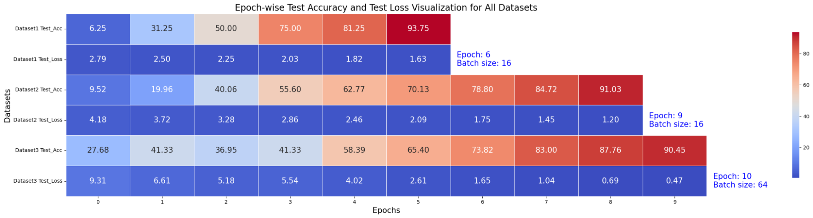
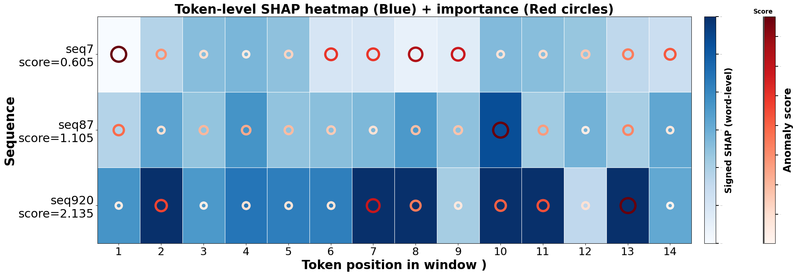
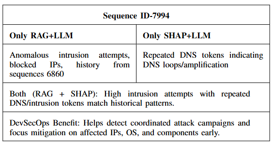

# AI-Driven DevSecOps Test Optimization
### Token-Level Log Anomaly Detection with LogBERT, XAI, RAG & LLMs

This project enhances **DevSecOps test-phase analysis** by detecting anomalies at the **token level** in logs from CI/CD pipelines, security scans, and testing workflows.

---

##  Scope

Analyzes logs from:  
- Unit, Integration, Functional & Regression Testing  
- CI/CD Build and Deployment  
- Static & Dynamic Security Testing (SAST & DAST)  
- Vulnerability & Dependency Scanning  
- Monitoring & Intrusion Detection  

---

##  Approach

### LogBERT for Token-Level Detection

- Captures sequential & contextual patterns in logs  
- Flags abnormal tokens indicating test failures or security issues  
- Transformer-based encoder with multi-head self-attention  

### SHAP + LLM Explainability

-  Red tokens → anomaly drivers (*failed*, *blocked*)  
-  Blue tokens → normal behavior reinforcement  
- LLM converts SHAP outputs into **human-readable explanations**  

### RAG + LLM Contextual Analysis

- Retrieves top-K similar historical logs  
- Synthesizes context-aware explanations  
- LLM provides **root-cause analysis and remediation guidance**  

---

##  Components

- `model_final.pt` – Pretrained LogBERT  
- `labelmap.json` – Token-ID mapping  
- `config.json` – Model configuration  
- `tokenizer/` – Preprocessing utilities  
- XAI + LLM & RAG + LLM modules  

---

##  DevSecOps Value

- Fine-grained **token-level anomaly detection**  
- Transparent, **human-readable explanations**  
- Rapid **root-cause analysis** for CI/CD pipelines  
- Enhanced **pipeline reliability, security, and traceability**  

---

> ⚡ This pipeline integrates **deep learning, explainable AI, and retrieval-augmented reasoning** to deliver actionable insights for DevSecOps teams.
